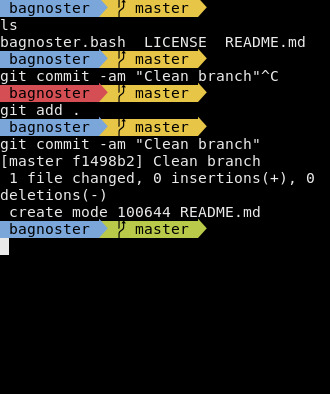

# Bagnoster

This is a BASH theme to make your shell look pretty. This is based on the [agnoster.zsh-theme](https://gist.github.com/agnoster/3712874) and [agnoster-bash](https://github.com/speedenator/agnoster-bash); however, this is written to be more condensed than either of those. If you commonly have a very small terminal up and still want to know about your git repo you are working in, this theme may be for you.

### Installing
```bash
source ${BAGNOSTER_THEME}
```
Insert that line into your `.bashrc`, where `${BAGNOSTER_THEME}` is the full path to `bagnoster.bash`.

### Features

* Powerline font if on a desktop terminal emulator
* Path color will turn red if previous command returned an error
* Path color will turn white if user is `root`
* Git working branch name is shown if current directory is a git repo
* Git color will turn yellow if repo has changes not committed
* Path will shorten to basename if terminal width is small
* The cursor will go to the next line if terminal width is small

Feature requests are welcome, but are likely to get shot down for the sake of script size, complexity, and speed.

### Goals

This is intended to be a small, lightweight theme that is targeted towards squeezing functionality into a small area of space.

### License

This is script is provided under the MIT License. See the `LICENSE` file for more details.
